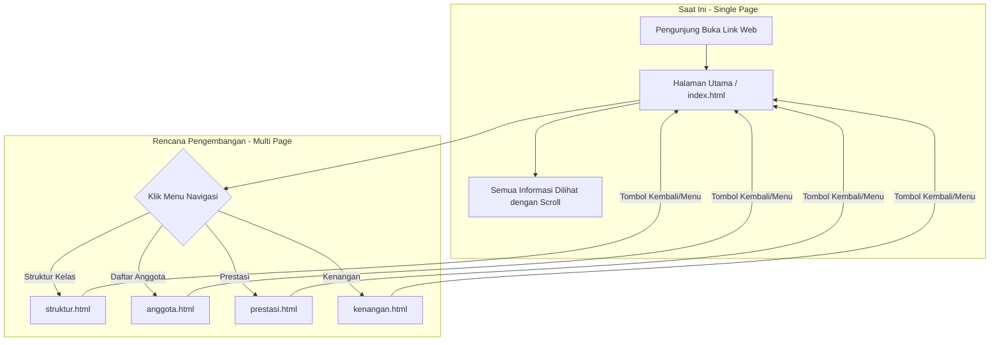

# Web-X-TKJ

```mermaid
flowchart TD
    %% Tampilan Saat Ini
    subgraph Saat Ini - Single Page
        A[Pengunjung Buka Link Web] --> B[Halaman Utama / index.html]
        B --> C[Semua Informasi Dilihat dengan Scroll]
    end

    %% Rencana Masa Depan
    subgraph Rencana Pengembangan - Multi Page
        B --> D{Klik Menu Navigasi}
        D -->|Struktur Kelas| E[struktur.html]
        D -->|Daftar Anggota| F[anggota.html]
        D -->|Prestasi| G[prestasi.html]
        D -->|Kenangan| H[kenangan.html]

        E -->|Tombol Kembali/Menu| B
        F -->|Tombol Kembali/Menu| B
        G -->|Tombol Kembali/Menu| B
        H -->|Tombol Kembali/Menu| B
    end
```
